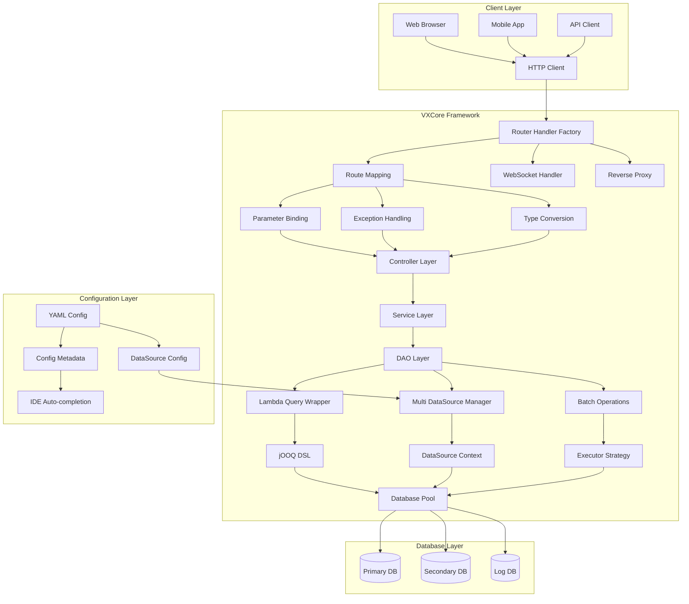
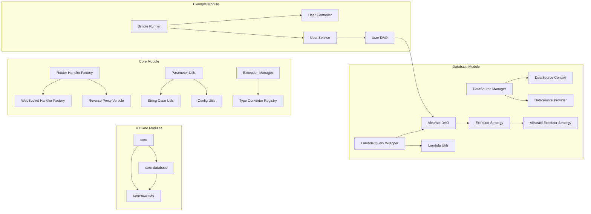

# VXCore 项目概述

## 🎯 项目简介

VXCore 是一个基于 **Vert.x** 和 **jOOQ** 的现代化 Java Web 框架，提供类似 Spring Boot 的开发体验，集成了代码生成器、Lambda 查询、多数据源、WebSocket、反向代理等企业级功能。

### 🌟 核心价值

- **🚀 高性能**: 基于 Vert.x 异步非阻塞 I/O，支持数万并发连接
- **🔒 类型安全**: 基于 jOOQ DSL 编译时检查，完全防止 SQL 注入
- **🌐 Web 开发**: 注解式路由、WebSocket、反向代理支持
- **🗄️ 多数据源**: 支持动态数据源切换和事务隔离
- **📈 易于扩展**: 支持 Lambda 查询、批量操作、SPI 扩展

## 🏗️ 系统架构

### 整体架构图



### 模块架构图



## 🎨 设计思想：简单而不失优雅

### 核心理念

VXCore 的设计哲学是"**简单而不失优雅**"，这一理念贯穿整个框架的设计和实现：

- **简单**: 降低学习成本，提供直观的 API 设计，让开发者能够快速上手
- **优雅**: 在简单的基础上，提供强大的功能和良好的扩展性，满足复杂业务需求
- **平衡**: 在简单性和功能性之间找到最佳平衡点，既不过度设计，也不功能缺失

### 设计原则

#### 1. 最小化认知负担
让开发者专注于业务逻辑，而不是框架细节

#### 2. 约定优于配置
提供合理的默认值，减少配置需求

#### 3. 类型安全优先
在编译时发现问题，而不是运行时

#### 4. 渐进式复杂度
从简单开始，按需增加复杂度

### 1. 响应式编程模型

VXCore 基于 Vert.x 的响应式编程模型，采用事件驱动、非阻塞 I/O：

```java
// 异步非阻塞的数据库操作
public Future<User> createUser(User user) {
    return userDao.create(user)
        .compose(createdUser -> {
            // 异步处理后续逻辑
            return sendWelcomeEmail(createdUser);
        })
        .recover(throwable -> {
            // 优雅的错误处理
            log.error("Failed to create user", throwable);
            return Future.failedFuture(new BusinessException("用户创建失败"));
        });
}
```

### 2. 类型安全的数据库操作

基于 jOOQ DSL 提供编译时类型检查：

```java
// 编译时类型检查，避免 SQL 注入
public Future<List<User>> findActiveUsers() {
    return userDao.lambdaQuery()
        .eq(User::getStatus, "ACTIVE")  // 类型安全的字段引用
        .like(User::getName, "张%")      // 编译时检查
        .orderBy(User::getCreateTime, SortOrder.DESC)
        .list();
}
```

### 3. 注解驱动的开发模式

类似 Spring Boot 的注解驱动开发：

```java
@RouteHandler("/api")
public class UserController {
    
    @RouteMapping(value = "/users", method = HttpMethod.GET)
    public Future<JsonResult> getUsers(@RequestParam("page") int page) {
        return userService.findUsers(page)
            .map(users -> JsonResult.success(users));
    }
    
    @ExceptionHandler(ValidationException.class)
    public JsonResult handleValidation(ValidationException e) {
        return JsonResult.fail(400, e.getMessage());
    }
}
```

### 4. 多数据源透明切换

支持动态数据源切换，对业务代码透明：

```java
@DataSource("primary")
public class UserDao extends AbstractDao<User> {
    
    @DataSource("secondary")
    public Future<List<Log>> findUserLogs(Long userId) {
        // 自动切换到 secondary 数据源
        return logDao.lambdaQuery()
            .eq(Log::getUserId, userId)
            .list();
    }
}
```

## 🔧 技术栈

### 核心框架
- **Java 17+**: 现代 Java 特性支持
- **Vert.x 4.5+**: 高性能异步框架
- **jOOQ 3.19+**: 类型安全的 SQL 构建
- **Maven 3.8+**: 现代化构建工具

### 数据库支持
- **H2**: 开发、测试、演示
- **MySQL**: 生产环境推荐
- **PostgreSQL**: 企业级应用

### 开发工具
- **IDE**: IntelliJ IDEA / Eclipse
- **构建**: Maven
- **测试**: JUnit 5
- **文档**: Markdown

## 📊 性能特性

### 高性能指标
- **并发处理**: 50,000+ QPS HTTP 请求
- **WebSocket**: 10,000+ 并发连接
- **数据库查询**: 10,000+ QPS
- **批量操作**: 1000 条记录 < 100ms
- **响应时间**: 微秒级延迟

### 性能优化策略
1. **异步非阻塞**: 基于 Vert.x 事件循环
2. **连接池管理**: 高效的数据库连接复用
3. **批量操作**: 减少网络往返次数
4. **内存优化**: 零拷贝、对象池
5. **CPU 友好**: 单线程事件循环

## 🎯 适用场景

### 企业级应用
- **微服务架构**: 支持服务间通信
- **高并发系统**: 电商、金融、游戏
- **实时应用**: 聊天、直播、监控
- **数据处理**: 批量处理、ETL 任务

### 开发团队
- **Java 开发者**: 熟悉 Spring Boot 的团队
- **高性能要求**: 需要处理大量并发
- **类型安全**: 重视代码质量和安全性
- **现代化开发**: 追求最新技术栈

## 🚀 快速体验

### 5分钟快速上手

```bash
# 1. 克隆项目
git clone https://github.com/qaiu/vxcore.git
cd vxcore

# 2. 编译项目
mvn clean compile

# 3. 运行示例
mvn exec:java -Dexec.mainClass="cn.qaiu.example.SimpleRunner"

# 4. 访问 API
curl http://localhost:8080/api/hello?name=VXCore
```

### 基础示例

```java
// 1. 定义实体
@DdlTable("users")
public class User extends BaseEntity {
    @DdlColumn("user_name")
    private String name;
    
    @DdlColumn("user_email")
    private String email;
}

// 2. 创建 DAO
public class UserDao extends AbstractDao<User> {
    public UserDao(JooqExecutor executor) {
        super(executor, User.class);
    }
}

// 3. 创建控制器
@RouteHandler("/api")
public class UserController {
    
    @RouteMapping(value = "/users", method = HttpMethod.GET)
    public Future<JsonResult> getUsers() {
        return userDao.lambdaQuery()
            .eq(User::getStatus, "ACTIVE")
            .list()
            .map(users -> JsonResult.success(users));
    }
}
```

## 📚 学习路径

### 新手入门 (1-2天)
1. [快速开始](02-quick-start.md) - 基础概念和第一个应用
2. [安装配置](03-installation.md) - 环境搭建
3. [无参构造函数DAO](13-no-arg-constructor-dao.md) - 掌握无参构造函数DAO的使用

### 进阶开发 (3-5天)
4. [Lambda 查询](../core-database/docs/lambda/LAMBDA_QUERY_GUIDE.md) - 数据库操作
5. [多数据源](../core-database/docs/MULTI_DATASOURCE_GUIDE.md) - 数据源管理
6. [路由注解](08-routing-annotations.md) - Web 开发基础
7. [异常处理](09-exception-handling.md) - 错误处理机制

### 高级特性 (1-2周)
8. [WebSocket 指南](WEBSOCKET_GUIDE.md) - 实时通信
9. [反向代理](WEBSOCKET_PROXY_GUIDE.md) - 代理配置
10. [配置管理](10-configuration.md) - 高级配置

## 🤝 社区支持

### 获取帮助
- **GitHub Issues**: [提交问题](https://github.com/qaiu/vxcore/issues)
- **讨论区**: [技术讨论](https://github.com/qaiu/vxcore/discussions)
- **邮件支持**: qaiu@qq.com

### 贡献指南
- **代码贡献**: 遵循项目代码规范
- **文档贡献**: 完善使用文档和示例
- **问题反馈**: 及时报告 Bug 和需求

## 📈 版本规划

### 当前版本 (v2.0.0)
- ✅ Lambda 查询增强
- ✅ 多数据源支持
- ✅ 批量操作优化
- ✅ 注解式路由
- ✅ WebSocket 支持

### 即将发布 (v2.1.0)
- 🔄 Code-gen 模板引擎
- 🔄 HTML 模板引擎
- 🔄 AOP 支持
- 🔄 事件总线

### 长期规划
- 📋 微服务支持
- 📋 监控集成
- 📋 云原生支持
- 📋 多语言支持

---

**🎯 VXCore - 让 Java Web 开发更简单、更高效、更现代！**

[快速开始 →](02-quick-start.md) | [安装配置 →](03-installation.md) | [查看文档 →](README.md)