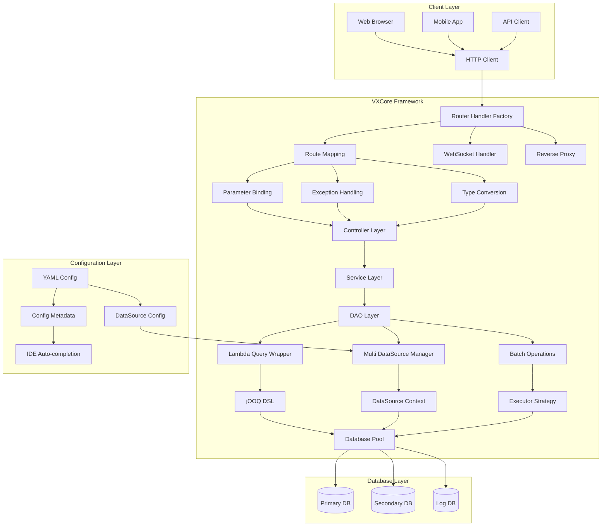
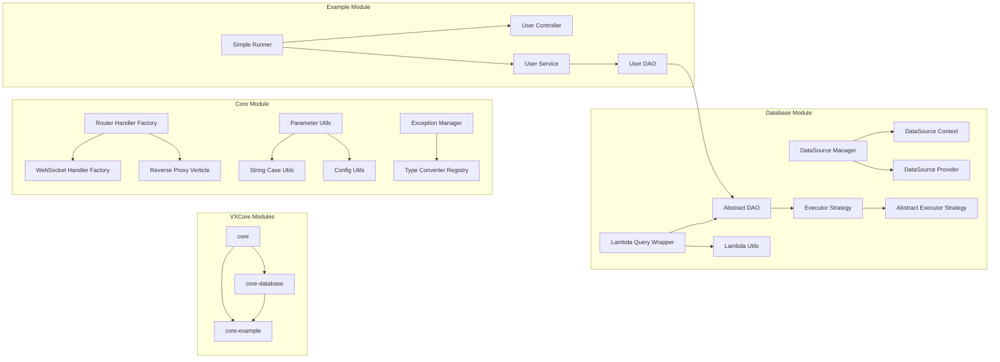

# VXCore（微克）项目概述

[English](en/01-overview.md) | [中文](README.md)

## 🎯 项目简介

**VXCore（微克）** 主打轻量：只做 **JSON API 服务**，核心打包 **30MB 以内**，不铺功能面。基于 **Vert.x** 和 **jOOQ** 的现代化 Java Web 框架，提供类似 Spring Boot 的开发体验，集成了代码生成器、Lambda 查询、多数据源、WebSocket、反向代理等企业级功能。对标 Quarkus：轻量、云原生、高性能、开发体验优先。

### 🌟 核心价值

- **🪶 轻量**: 核心体积 30MB 以内，专注 JSON API，无冗余
- **🚀 高性能**: 基于 Vert.x 异步非阻塞 I/O，支持数万并发连接
- **🔒 类型安全**: 基于 jOOQ DSL 编译时检查，完全防止 SQL 注入
- **🌐 Web 开发**: 注解式路由、WebSocket、反向代理支持
- **🗄️ 多数据源**: 支持动态数据源切换和事务隔离
- **📈 易于扩展**: 支持 Lambda 查询、批量操作、SPI 扩展

## 🏗️ 系统架构

### 整体架构图


```mermaid
graph TB
    subgraph "Client Layer"
        A[Web Browser] --> B[HTTP Client]
        C[Mobile App] --> B
        D[API Client] --> B
    end
    
    subgraph "VXCore Framework"
        B --> E[Router Handler Factory]
        E --> F[Route Mapping]
        E --> G[WebSocket Handler]
        E --> H[Reverse Proxy]
        
        F --> I[Parameter Binding]
        F --> J[Exception Handling]
        F --> K[Type Conversion]
        
        I --> L[Controller Layer]
        J --> L
        K --> L
        
        L --> M[Service Layer]
        M --> N[DAO Layer]
        
        N --> O[Lambda Query Wrapper]
        N --> P[Multi DataSource Manager]
        N --> Q[Batch Operations]
        
        O --> R[jOOQ DSL]
        P --> S[DataSource Context]
        Q --> T[Executor Strategy]
        
        R --> U[Database Pool]
        S --> U
        T --> U
    end
    
    subgraph "Database Layer"
        U --> V[(Primary DB)]
        U --> W[(Secondary DB)]
        U --> X[(Log DB)]
    end
    
    subgraph "Configuration Layer"
        Y[YAML Config] --> Z[Config Metadata]
        Z --> AA[IDE Auto-completion]
        Y --> BB[DataSource Config]
        BB --> P
    end
```

### 模块架构图


```mermaid
graph LR
    subgraph "VXCore Modules"
        A[core] --> B[core-database]
        A --> C[core-example]
        B --> C
    end
    
    subgraph "Core Module"
        D[Router Handler Factory] --> E[WebSocket Handler Factory]
        D --> F[Reverse Proxy Verticle]
        G[Parameter Utils] --> H[String Case Utils]
        G --> I[Config Utils]
        J[Exception Manager] --> K[Type Converter Registry]
    end
    
    subgraph "Database Module"
        L[Lambda Query Wrapper] --> M[Abstract DAO]
        L --> N[Lambda Utils]
        O[DataSource Manager] --> P[DataSource Context]
        O --> Q[DataSource Provider]
        R[Executor Strategy] --> S[Abstract Executor Strategy]
        M --> R
    end
    
    subgraph "Example Module"
        T[Simple Runner] --> U[User Controller]
        T --> V[User Service]
        V --> W[User DAO]
        W --> M
    end
```

## 🎨 设计思想：简单而不失优雅

### 核心理念

VXCore 的设计哲学是"**简单而不失优雅**"，这一理念贯穿整个框架的设计和实现：

- **简单**: 降低学习成本，提供直观的 API 设计，让开发者能够快速上手
- **优雅**: 在简单的基础上，提供强大的功能和良好的扩展性，满足复杂业务需求
- **平衡**: 在简单性和功能性之间找到最佳平衡点，既不过度设计，也不功能缺失

### 设计原则

#### 1. 最小化认知负担
让开发者专注于业务逻辑，而不是框架细节

#### 2. 约定优于配置
提供合理的默认值，减少配置需求

#### 3. 类型安全优先
在编译时发现问题，而不是运行时

#### 4. 渐进式复杂度
从简单开始，按需增加复杂度

### 1. 响应式编程模型

VXCore 基于 Vert.x 的响应式编程模型，采用事件驱动、非阻塞 I/O。与传统线程-请求模型相比，事件循环模型能以极小的内存代价处理海量并发。

#### Vert.x 事件循环工作原理

Vert.x 在启动时创建 **Event Loop 线程**（默认数量 = CPU 核数 × 2），所有 I/O 操作注册回调后立即返回，线程永不阻塞。当 I/O 完成（数据库响应、网络读写）时，对应的回调被调度回 Event Loop 执行。

```
                    ┌─────────────────────────────────────────┐
  HTTP 请求  ──────►│           Event Loop Thread             │
  DB 响应   ──────►│                                         │
  I/O 完成  ──────►│  事件队列 → 分发 → 执行回调 → 下一个事件  │
  Timer     ──────►│                                         │
                    └─────────────────────────────────────────┘
                              线程始终繁忙，从不阻塞等待
```

#### Verticle：Vert.x 的并发单元

每个 **Verticle** 是一段在单一 Event Loop 上运行的逻辑单元，无共享状态、无锁竞争：

```java
// VXCore 启动时自动部署 Verticle
public class MyApp {
    public static void main(String[] args) {
        // 框架自动扫描并部署 Verticle，绑定路由
        VXCoreApplication.run(MyApp.class);
    }
}
// 内部等同于：
// Vertx.vertx().deployVerticle(new HttpServerVerticle(), options);
// 多 CPU 核心时可部署多个实例：new DeploymentOptions().setInstances(cpuCores)
```

#### Future 组合：异步调用链

`Future` 是 Vert.x 中异步操作的核心抽象，支持链式组合，彻底避免回调地狱：

```java
// 串行：查询用户 → 校验库存 → 扣款 → 创建订单，全程非阻塞
public Future<Order> placeOrder(OrderRequest req) {
    return userDao.findById(req.getUserId())            // Step 1: 异步查库
        .compose(user -> checkInventory(req))           // Step 2: 异步验库存
        .compose(ok  -> chargeAccount(req))             // Step 3: 异步扣款
        .compose(pay -> orderDao.save(req, pay))        // Step 4: 异步入库
        .recover(e   -> {
            rollback(req);                              // 任意步失败，自动补偿
            return Future.failedFuture(e);
        });
}

// 并行：同时发起多个异步操作，等所有完成再继续
public Future<Dashboard> loadDashboard(Long userId) {
    Future<List<Order>>  ordersFuture  = orderDao.findByUser(userId);
    Future<List<Notice>> noticesFuture = noticeDao.findUnread(userId);
    Future<UserStats>    statsFuture   = statsService.compute(userId);

    return Future.all(ordersFuture, noticesFuture, statsFuture)
        .map(cf -> new Dashboard(
            cf.resultAt(0), cf.resultAt(1), cf.resultAt(2)
        ));
    // 三个查询并发执行，总耗时 ≈ max(单个耗时)，而非三者之和
}
```

### 2. 类型安全的数据库操作

基于 jOOQ DSL 提供编译时类型检查：

```java
// 编译时类型检查，避免 SQL 注入
public Future<List<User>> findActiveUsers() {
    return userDao.lambdaQuery()
        .eq(User::getStatus, "ACTIVE")  // 类型安全的字段引用
        .like(User::getName, "张%")      // 编译时检查
        .orderBy(User::getCreateTime, SortOrder.DESC)
        .list();
}
```

### 3. 注解驱动的开发模式

类似 Spring Boot 的注解驱动开发：

```java
@RouteHandler("/api")
public class UserController {
    
    @RouteMapping(value = "/users", method = HttpMethod.GET)
    public Future<JsonResult> getUsers(@RequestParam("page") int page) {
        return userService.findUsers(page)
            .map(users -> JsonResult.success(users));
    }
    
    @ExceptionHandler(ValidationException.class)
    public JsonResult handleValidation(ValidationException e) {
        return JsonResult.fail(400, e.getMessage());
    }
}
```

### 4. 多数据源透明切换

支持动态数据源切换，对业务代码透明：

```java
@DataSource("primary")
public class UserDao extends AbstractDao<User> {
    
    @DataSource("secondary")
    public Future<List<Log>> findUserLogs(Long userId) {
        // 自动切换到 secondary 数据源
        return logDao.lambdaQuery()
            .eq(Log::getUserId, userId)
            .list();
    }
}
```

## 🔧 技术栈

### 核心框架
- **Java 17+**: 现代 Java 特性支持
- **Vert.x 4.5+**: 高性能异步框架
- **jOOQ 3.19+**: 类型安全的 SQL 构建
- **Maven 3.8+**: 现代化构建工具

### 数据库支持
- **H2**: 开发、测试、演示
- **MySQL**: 生产环境推荐
- **PostgreSQL**: 企业级应用

### 开发工具
- **IDE**: IntelliJ IDEA / Eclipse
- **构建**: Maven
- **测试**: JUnit 5
- **文档**: Markdown

## 📊 性能特性

### 与传统框架对比

| 维度 | Spring MVC（Tomcat） | VXCore（Vert.x） |
|------|---------------------|-----------------|
| 并发模型 | 每请求一线程，线程池阻塞等待 | Event Loop + 非阻塞回调 |
| 每连接内存开销 | ~1 MB（线程栈） | 几 KB（回调上下文） |
| 1 万并发内存 | ~10 GB | ~数百 MB |
| I/O 等待时线程状态 | 阻塞（WAITING） | 继续处理其他事件 |
| 吞吐量 | 受线程池大小上限 | 接近硬件 I/O 极限 |
| 延迟特性 | 线程调度 + 上下文切换开销 | 微秒级事件分发 |
| 适合场景 | CPU 密集型、短时计算 | I/O 密集型、高并发、实时 |

### 性能指标

- **HTTP 吞吐量**: 单节点 50,000+ QPS
- **WebSocket 并发**: 10,000+ 长连接
- **数据库查询**: 10,000+ QPS（含连接池开销）
- **批量写入**: 1,000 条记录 < 100ms
- **事件分发延迟**: 微秒级

### 为什么非阻塞 I/O 如此重要

典型 Web 应用中，**一个请求的处理时间有 80~95% 用于等待 I/O**（数据库、缓存、下游 HTTP、文件读写）。

- **阻塞模型**：等待期间线程挂起，CPU 资源浪费，必须用大线程池对冲，内存消耗随并发线性增长
- **非阻塞模型**：等待期间线程继续处理其他请求，CPU 始终满载，并发数不受线程数限制

```
阻塞模型（100并发）：
  线程1: [处理5ms] [──等待DB 50ms──] [处理3ms] [──等待网络 30ms──]
  线程2: [处理5ms] [──等待DB 50ms──] ...
  线程N: 全部阻塞等待中 → 新请求排队 → 延迟增加

非阻塞模型（100并发）：
  EventLoop: [处理req1] [注册DB回调] [处理req2] [注册DB回调] ... [req1 DB返回→处理] [req2 DB返回→处理]
  全程无阻塞，吞吐量仅受 CPU 和 I/O 带宽限制
```

### 性能优化策略

1. **Event Loop 优先**: 业务代码返回 `Future`，不在 Event Loop 线程上做阻塞操作
2. **并行聚合**: 用 `Future.all()` 并发发出多个 I/O 请求，而非串行等待
3. **连接池复用**: jOOQ 底层数据库连接池，高效复用减少建连开销
4. **批量操作**: `batchInsert` / `batchUpdate` 减少网络往返次数
5. **零拷贝 I/O**: Netty 底层 `DirectBuffer`，减少内核态/用户态数据复制
6. **多实例部署**: 一台机器部署 `CPU × 2` 个 Verticle 实例，充分利用多核

## 🎯 适用场景

### 企业级应用
- **微服务架构**: 支持服务间通信
- **高并发系统**: 电商、金融、游戏
- **实时应用**: 聊天、直播、监控
- **数据处理**: 批量处理、ETL 任务

### 开发团队
- **Java 开发者**: 熟悉 Spring Boot 的团队
- **高性能要求**: 需要处理大量并发
- **类型安全**: 重视代码质量和安全性
- **现代化开发**: 追求最新技术栈

## 🚀 快速体验

### 5分钟快速上手

```bash
# 1. 克隆项目
git clone https://github.com/qaiu/vxcore.git
cd vxcore

# 2. 编译项目
mvn clean compile

# 3. 运行示例
mvn exec:java -Dexec.mainClass="cn.qaiu.example.SimpleRunner"

# 4. 访问 API
curl http://localhost:8080/api/hello?name=VXCore
```

### 基础示例

```java
// 1. 定义实体
@DdlTable("users")
public class User extends BaseEntity {
    @DdlColumn("user_name")
    private String name;
    
    @DdlColumn("user_email")
    private String email;
}

// 2. 创建 DAO
public class UserDao extends AbstractDao<User> {
    public UserDao(JooqExecutor executor) {
        super(executor, User.class);
    }
}

// 3. 创建控制器
@RouteHandler("/api")
public class UserController {
    
    @RouteMapping(value = "/users", method = HttpMethod.GET)
    public Future<JsonResult> getUsers() {
        return userDao.lambdaQuery()
            .eq(User::getStatus, "ACTIVE")
            .list()
            .map(users -> JsonResult.success(users));
    }
}
```

## 📚 学习路径

### 新手入门 (1-2天)
1. [快速开始](02-quick-start.md) - 基础概念和第一个应用
2. [安装配置](03-installation.md) - 环境搭建
3. [无参构造函数DAO](13-no-arg-constructor-dao.md) - 掌握无参构造函数DAO的使用

### 进阶开发 (3-5天)
4. [Lambda 查询](../core-database/docs/lambda/LAMBDA_QUERY_GUIDE.md) - 数据库操作
5. [多数据源](../core-database/docs/MULTI_DATASOURCE_GUIDE.md) - 数据源管理
6. [路由注解](08-routing-annotations.md) - Web 开发基础
7. [异常处理](09-exception-handling.md) - 错误处理机制

### 高级特性 (1-2周)
8. [WebSocket 指南](WEBSOCKET_GUIDE.md) - 实时通信
9. [反向代理](WEBSOCKET_PROXY_GUIDE.md) - 代理配置
10. [配置管理](10-configuration.md) - 高级配置

## 🤝 社区支持

### 获取帮助
- **GitHub Issues**: [提交问题](https://github.com/qaiu/vxcore/issues)
- **讨论区**: [技术讨论](https://github.com/qaiu/vxcore/discussions)
- **邮件支持**: qaiu@qq.com

### 贡献指南
- **代码贡献**: 遵循项目代码规范
- **文档贡献**: 完善使用文档和示例
- **问题反馈**: 及时报告 Bug 和需求

## 📈 版本规划

### 当前版本 (v1.2.3)
- ✅ Lambda 查询增强
- ✅ 多数据源支持
- ✅ 批量操作优化
- ✅ 注解式路由
- ✅ WebSocket 支持
- ✅ AOP 切面编程
- ✅ 安全认证框架
- ✅ 依赖注入 (Dagger2)
- ✅ 依赖漏洞修复 (Jackson/Logback/Vert.x/PostgreSQL)
- ✅ AOP 代理修复
- ✅ JaCoCo 测试覆盖率启用

### 即将发布 (v1.3.0)
- 🔄 Code-gen 模板引擎
- 🔄 HTML 模板引擎
- 🔄 事件总线

### 长期规划
- 📋 微服务支持
- 📋 监控集成
- 📋 云原生支持
- 📋 多语言支持

---

**🎯 VXCore - 让 Java Web 开发更简单、更高效、更现代！**

[快速开始 →](02-quick-start.md) | [安装配置 →](03-installation.md) | [查看文档 →](README.md)