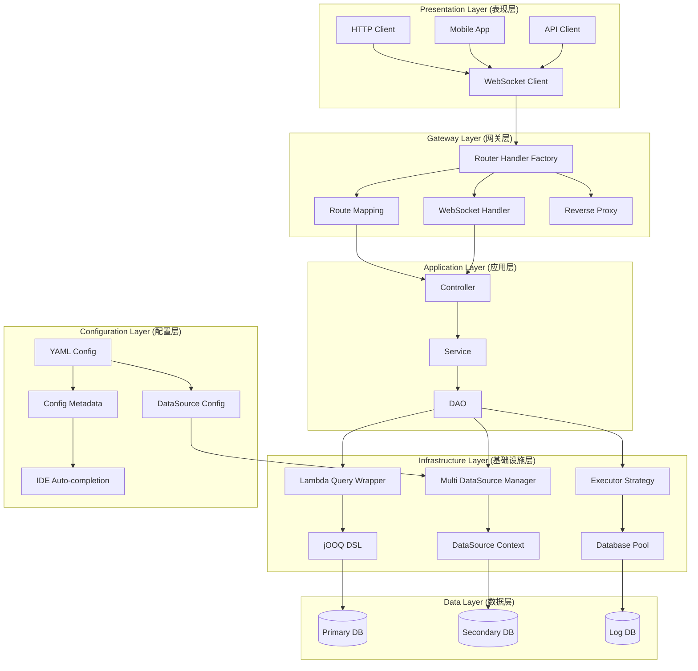
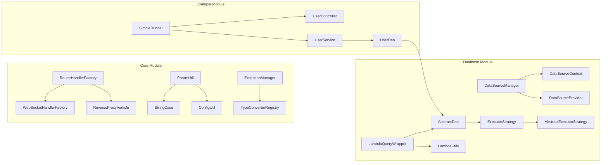
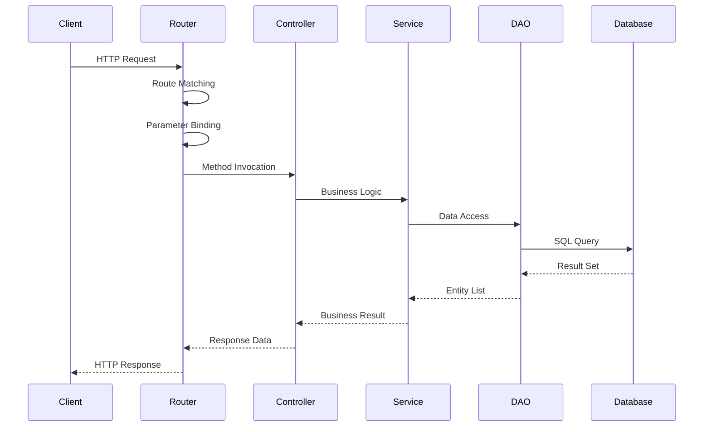
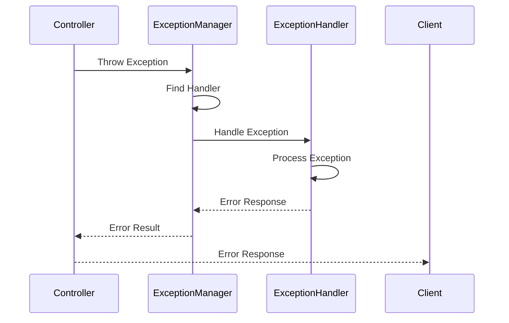
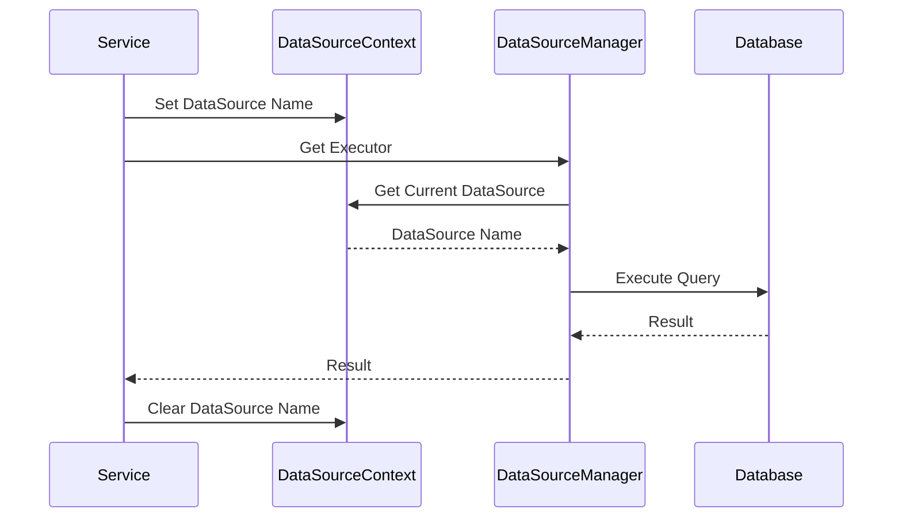

# VXCore 系统架构设计

## 🎯 架构概述

VXCore 采用分层架构设计，结合响应式编程模型，提供高性能、可扩展的 Web 应用开发框架。

## 🎨 设计思想：简单而不失优雅

### 核心理念

VXCore 的设计哲学是"**简单而不失优雅**"，这一理念贯穿整个框架的设计和实现：

- **简单**: 降低学习成本，提供直观的 API 设计，让开发者能够快速上手
- **优雅**: 在简单的基础上，提供强大的功能和良好的扩展性，满足复杂业务需求
- **平衡**: 在简单性和功能性之间找到最佳平衡点，既不过度设计，也不功能缺失

### 设计原则

#### 1. 最小化认知负担

**原则**: 让开发者专注于业务逻辑，而不是框架细节

```java
// 简单直观的控制器设计
@RouteHandler("/api")
public class UserController {
    
    @RouteMapping(value = "/users", method = HttpMethod.GET)
    public Future<JsonResult> getUsers(@RequestParam("page") int page) {
        return userService.findUsers(page)
            .map(users -> JsonResult.success(users));
    }
}

// 对比传统框架的复杂性
// 无需复杂的配置类、无需繁琐的依赖注入、无需冗长的样板代码
```

#### 2. 约定优于配置

**原则**: 提供合理的默认值，减少配置需求

```yaml
# 最小化配置，框架提供智能默认值
datasources:
  primary:
    url: jdbc:h2:mem:testdb
    # 其他配置使用默认值，框架自动处理
```

#### 3. 类型安全优先

**原则**: 在编译时发现问题，而不是运行时

```java
// 编译时类型检查，避免运行时错误
public Future<List<User>> findActiveUsers() {
    return userDao.lambdaQuery()
        .eq(User::getStatus, "ACTIVE")  // 编译时检查字段存在性
        .like(User::getName, "张%")      // 编译时检查类型匹配
        .orderBy(User::getCreateTime, SortOrder.DESC)
        .list();
}
```

#### 4. 渐进式复杂度

**原则**: 从简单开始，按需增加复杂度

```java
// 基础用法：简单直接
@RouteMapping("/hello")
public Future<String> hello() {
    return Future.succeededFuture("Hello World");
}

// 进阶用法：按需添加功能
@RouteMapping("/users")
public Future<JsonResult> getUsers(
    @RequestParam("page") int page,
    @RequestParam("size") int size,
    @RequestParam(value = "sort", required = false) String sort
) {
    return userService.findUsers(page, size, sort)
        .map(users -> JsonResult.success(users));
}

// 高级用法：复杂业务逻辑
@RouteMapping("/users", method = HttpMethod.POST)
public Future<JsonResult> createUser(@RequestBody User user) {
    return userService.createUser(user)
        .compose(createdUser -> auditService.logUserCreation(createdUser))
        .compose(auditResult -> notificationService.sendWelcomeEmail(user))
        .map(result -> JsonResult.success(result))
        .recover(throwable -> {
            log.error("Failed to create user", throwable);
            return Future.succeededFuture(JsonResult.fail("用户创建失败"));
        });
}
```

### 优雅的实现方式

#### 1. 智能默认值

```java
// 框架自动处理常见场景
public class RouterHandlerFactory {
    
    // 自动扫描包路径，无需手动注册
    public void scanAndRegisterHandlers(String packageName) {
        // 智能扫描，自动发现控制器
    }
    
    // 自动参数绑定，支持多种类型
    public static Object[] bindParameters(Method method, RoutingContext context) {
        // 智能类型转换，自动处理常见类型
    }
}
```

#### 2. 流畅的 API 设计

```java
// 链式调用，表达力强
public Future<List<User>> findUsersWithOrders() {
    return userDao.lambdaQuery()
        .eq(User::getStatus, "ACTIVE")
        .leftJoin(Order.class, (user, order) -> 
            user.getId().eq(order.getUserId()))
        .groupBy(User::getId)
        .having(DSL.count(Order.ID).gt(0))
        .orderBy(User::getCreateTime, SortOrder.DESC)
        .list();
}
```

#### 3. 优雅的错误处理

```java
// 全局异常处理，优雅降级
@ExceptionHandler(DatabaseException.class)
public JsonResult handleDatabaseException(DatabaseException e) {
    log.error("Database error occurred", e);
    return JsonResult.fail(500, "服务暂时不可用，请稍后重试");
}

// 局部异常处理，精确控制
@RouteMapping("/users")
public Future<JsonResult> getUsers() {
    return userService.findUsers()
        .map(users -> JsonResult.success(users))
        .recover(throwable -> {
            if (throwable instanceof ValidationException) {
                return Future.succeededFuture(JsonResult.fail(400, throwable.getMessage()));
            }
            return Future.succeededFuture(JsonResult.fail(500, "系统错误"));
        });
}
```

#### 4. 扩展性设计

```java
// SPI 扩展机制，保持核心简单
public interface DataSourceProvider {
    String getType();
    Pool createPool(DataSourceConfig config);
}

// 自定义扩展，不影响核心功能
public class CustomDataSourceProvider implements DataSourceProvider {
    @Override
    public String getType() {
        return "custom";
    }
    
    @Override
    public Pool createPool(DataSourceConfig config) {
        // 自定义实现，框架自动集成
    }
}
```

### 简单与优雅的平衡

#### 1. API 设计平衡

```java
// 简单：基础功能易用
public Future<User> findById(Long id) {
    return userDao.findById(id);
}

// 优雅：高级功能强大
public Future<List<User>> findUsers(UserQuery query) {
    return userDao.lambdaQuery()
        .eqIf(query.getName() != null, User::getName, query.getName())
        .eqIf(query.getStatus() != null, User::getStatus, query.getStatus())
        .betweenIf(query.getStartDate() != null && query.getEndDate() != null, 
                   User::getCreateTime, query.getStartDate(), query.getEndDate())
        .orderBy(User::getCreateTime, SortOrder.DESC)
        .list();
}
```

#### 2. 配置复杂度平衡

```yaml
# 简单：基础配置
datasources:
  primary:
    url: jdbc:h2:mem:testdb

# 优雅：高级配置
datasources:
  primary:
    url: jdbc:mysql://localhost:3306/main_db
    username: root
    password: password
    driver: com.mysql.cj.jdbc.Driver
    pool:
      maxSize: 20
      minSize: 5
      maxWaitTime: 30000
      evictionInterval: 60000
    options:
      useSSL: false
      serverTimezone: UTC
      characterEncoding: utf8mb4
```

#### 3. 学习曲线平衡

```java
// 新手友好：5分钟上手
@RouteHandler("/api")
public class HelloController {
    @RouteMapping("/hello")
    public Future<String> hello(@RequestParam("name") String name) {
        return Future.succeededFuture("Hello, " + name);
    }
}

// 专家级：复杂业务处理
@RouteHandler("/api")
public class UserController {
    @RouteMapping("/users", method = HttpMethod.POST)
    public Future<JsonResult> createUser(@RequestBody User user) {
        return userService.createUser(user)
            .compose(createdUser -> {
                return Future.all(
                    auditService.logUserCreation(createdUser),
                    notificationService.sendWelcomeEmail(createdUser),
                    cacheService.invalidateUserCache(createdUser.getId())
                );
            })
            .map(result -> JsonResult.success(result))
            .recover(throwable -> {
                return handleUserCreationError(throwable);
            });
    }
}
```

### 设计思想的体现

#### 1. 在框架架构中的体现

- **分层清晰**: 每层职责明确，降低耦合度
- **模块化**: 核心功能独立，可选功能插件化
- **可扩展**: 提供扩展点，支持自定义实现

#### 2. 在 API 设计中的体现

- **直观命名**: 方法名和参数名语义明确
- **类型安全**: 编译时检查，避免运行时错误
- **链式调用**: 提高代码可读性和表达力

#### 3. 在配置管理中的体现

- **约定优于配置**: 提供合理默认值
- **渐进式配置**: 从简单到复杂，按需配置
- **类型安全配置**: 配置元数据，IDE 自动提示

#### 4. 在错误处理中的体现

- **优雅降级**: 错误发生时不影响系统稳定性
- **详细信息**: 提供足够的错误信息用于调试
- **统一处理**: 全局和局部异常处理机制

### 总结

VXCore 的"简单而不失优雅"设计思想体现在：

1. **简单**: 降低学习成本，提供直观的 API
2. **优雅**: 在简单基础上提供强大功能和良好扩展性
3. **平衡**: 在简单性和功能性之间找到最佳平衡点
4. **渐进**: 从简单开始，按需增加复杂度
5. **类型安全**: 编译时检查，避免运行时错误
6. **约定优于配置**: 减少配置需求，提供智能默认值

这一设计思想使 VXCore 既适合新手快速上手，也能满足专家级用户的复杂需求，真正实现了"简单而不失优雅"的目标。

## 🏗️ 整体架构

### 架构层次图



### 核心组件关系图



## 🔧 核心模块设计

### 1. Core Module (核心模块)

#### 1.1 路由处理工厂 (RouterHandlerFactory)

**职责**: 负责扫描和注册路由处理器

**设计模式**: 工厂模式 + 策略模式

```java
public class RouterHandlerFactory {
    
    /**
     * 扫描并注册路由处理器
     */
    public void scanAndRegisterHandlers(String packageName) {
        // 1. 扫描包下的所有类
        Set<Class<?>> classes = ClassScanner.scanPackage(packageName);
        
        // 2. 过滤带有 @RouteHandler 注解的类
        List<Class<?>> controllers = classes.stream()
            .filter(clazz -> clazz.isAnnotationPresent(RouteHandler.class))
            .collect(Collectors.toList());
        
        // 3. 注册每个控制器
        controllers.forEach(this::registerController);
    }
    
    /**
     * 注册单个控制器
     */
    private void registerController(Class<?> controllerClass) {
        // 1. 获取基础路径
        RouteHandler routeHandler = controllerClass.getAnnotation(RouteHandler.class);
        String basePath = routeHandler.value();
        
        // 2. 扫描控制器方法
        Method[] methods = controllerClass.getDeclaredMethods();
        
        // 3. 注册每个路由方法
        Arrays.stream(methods)
            .filter(method -> method.isAnnotationPresent(RouteMapping.class))
            .forEach(method -> registerRouteMethod(controllerClass, method, basePath));
    }
}
```

#### 1.2 参数绑定机制 (ParamUtil)

**职责**: 处理 HTTP 请求参数到方法参数的绑定

**设计模式**: 策略模式 + 责任链模式

```java
public class ParamUtil {
    
    private static final TypeConverterRegistry CONVERTER_REGISTRY = new TypeConverterRegistry();
    
    /**
     * 绑定参数到方法
     */
    public static Object[] bindParameters(Method method, RoutingContext context) {
        Parameter[] parameters = method.getParameters();
        Object[] args = new Object[parameters.length];
        
        for (int i = 0; i < parameters.length; i++) {
            Parameter param = parameters[i];
            args[i] = bindParameter(param, context);
        }
        
        return args;
    }
    
    /**
     * 绑定单个参数
     */
    private static Object bindParameter(Parameter parameter, RoutingContext context) {
        // 1. 检查参数注解
        if (parameter.isAnnotationPresent(RequestParam.class)) {
            return bindRequestParam(parameter, context);
        } else if (parameter.isAnnotationPresent(PathVariable.class)) {
            return bindPathVariable(parameter, context);
        } else if (parameter.isAnnotationPresent(RequestBody.class)) {
            return bindRequestBody(parameter, context);
        }
        
        // 2. 默认绑定策略
        return bindDefault(parameter, context);
    }
}
```

#### 1.3 异常处理机制 (ExceptionManager)

**职责**: 统一处理应用异常

**设计模式**: 责任链模式 + 策略模式

```java
public class ExceptionManager {
    
    private static final Map<Class<? extends Throwable>, ExceptionHandler<?>> HANDLERS = new ConcurrentHashMap<>();
    
    /**
     * 处理异常
     */
    public static JsonResult handleException(Throwable throwable, RoutingContext context) {
        // 1. 查找匹配的异常处理器
        ExceptionHandler<?> handler = findHandler(throwable.getClass());
        
        if (handler != null) {
            try {
                return ((ExceptionHandler<Throwable>) handler).handle(throwable, context);
            } catch (Exception e) {
                log.error("异常处理器执行失败", e);
            }
        }
        
        // 2. 使用默认处理器
        return handleDefault(throwable, context);
    }
    
    /**
     * 查找异常处理器
     */
    private static ExceptionHandler<?> findHandler(Class<? extends Throwable> exceptionType) {
        // 精确匹配
        ExceptionHandler<?> handler = HANDLERS.get(exceptionType);
        if (handler != null) {
            return handler;
        }
        
        // 继承关系匹配
        for (Map.Entry<Class<? extends Throwable>, ExceptionHandler<?>> entry : HANDLERS.entrySet()) {
            if (entry.getKey().isAssignableFrom(exceptionType)) {
                return entry.getValue();
            }
        }
        
        return null;
    }
}
```

### 2. Database Module (数据库模块)

#### 2.1 Lambda 查询包装器 (LambdaQueryWrapper)

**职责**: 提供类型安全的 Lambda 表达式查询

**设计模式**: 建造者模式 + 策略模式

```java
public class LambdaQueryWrapper<T> {
    
    private final Class<T> entityClass;
    private final List<Condition> conditions = new ArrayList<>();
    private final List<JoinInfo> joins = new ArrayList<>();
    private final List<Field<?>> groupByFields = new ArrayList<>();
    private final List<Condition> havingConditions = new ArrayList<>();
    private final List<SortField<?>> orderByFields = new ArrayList<>();
    
    /**
     * 等值查询
     */
    public <R> LambdaQueryWrapper<T> eq(SFunction<T, R> column, R value) {
        String fieldName = LambdaUtils.getFieldName(column);
        Field<R> field = DSL.field(fieldName, (Class<R>) value.getClass());
        conditions.add(field.eq(value));
        return this;
    }
    
    /**
     * 左连接
     */
    public <J> LambdaQueryWrapper<T> leftJoin(Class<J> joinClass, BiFunction<T, J, Condition> on) {
        String joinTableName = getTableName(joinClass);
        Table<J> joinTable = DSL.table(joinTableName);
        joins.add(new JoinInfo(JoinType.LEFT_JOIN, joinTable, on));
        return this;
    }
    
    /**
     * 分组查询
     */
    public LambdaQueryWrapper<T> groupBy(SFunction<T, ?>... columns) {
        for (SFunction<T, ?> column : columns) {
            String fieldName = LambdaUtils.getFieldName(column);
            Field<?> field = DSL.field(fieldName);
            groupByFields.add(field);
        }
        return this;
    }
    
    /**
     * 构建查询
     */
    public Select<?> buildSelect() {
        Select<?> select = DSL.select(getSelectFields())
            .from(getMainTable());
        
        // 添加连接
        for (JoinInfo join : joins) {
            select = select.leftJoin(join.getTable()).on(join.getCondition());
        }
        
        // 添加条件
        if (!conditions.isEmpty()) {
            Condition whereCondition = conditions.stream()
                .reduce(Condition::and)
                .orElse(DSL.trueCondition());
            select = select.where(whereCondition);
        }
        
        // 添加分组
        if (!groupByFields.isEmpty()) {
            select = select.groupBy(groupByFields);
        }
        
        // 添加 Having
        if (!havingConditions.isEmpty()) {
            Condition havingCondition = havingConditions.stream()
                .reduce(Condition::and)
                .orElse(DSL.trueCondition());
            select = select.having(havingCondition);
        }
        
        // 添加排序
        if (!orderByFields.isEmpty()) {
            select = select.orderBy(orderByFields);
        }
        
        return select;
    }
}
```

#### 2.2 多数据源管理器 (DataSourceManager)

**职责**: 管理多个数据源的创建、切换和销毁

**设计模式**: 单例模式 + 策略模式

```java
public class DataSourceManager {
    
    private static final DataSourceManager INSTANCE = new DataSourceManager();
    private final Map<String, JooqExecutor> executors = new ConcurrentHashMap<>();
    private final DataSourceProviderRegistry providerRegistry = new DataSourceProviderRegistry();
    
    private DataSourceManager() {}
    
    public static DataSourceManager getInstance() {
        return INSTANCE;
    }
    
    /**
     * 注册数据源
     */
    public void registerDataSource(String name, DataSourceConfig config) {
        try {
            // 1. 创建数据源提供者
            DataSourceProvider provider = providerRegistry.getProvider(config.getType());
            
            // 2. 创建连接池
            Pool pool = provider.createPool(config);
            
            // 3. 创建执行器
            JooqExecutor executor = new JooqExecutor(pool);
            
            // 4. 注册执行器
            executors.put(name, executor);
            
            log.info("数据源 {} 注册成功", name);
        } catch (Exception e) {
            log.error("数据源 {} 注册失败", name, e);
            throw new RuntimeException("数据源注册失败", e);
        }
    }
    
    /**
     * 获取执行器
     */
    public JooqExecutor getExecutor(String name) {
        JooqExecutor executor = executors.get(name);
        if (executor == null) {
            throw new IllegalArgumentException("数据源 " + name + " 不存在");
        }
        return executor;
    }
    
    /**
     * 获取当前数据源执行器
     */
    public JooqExecutor getCurrentExecutor() {
        String currentDataSource = DataSourceContext.getDataSourceName();
        if (currentDataSource != null) {
            return getExecutor(currentDataSource);
        }
        return getExecutor("primary");
    }
}
```

#### 2.3 执行器策略 (ExecutorStrategy)

**职责**: 定义数据库执行策略接口

**设计模式**: 策略模式

```java
public interface ExecutorStrategy {
    
    /**
     * 执行查询
     */
    Future<RowSet> executeQuery(Pool pool, Query query);
    
    /**
     * 执行更新
     */
    Future<Integer> executeUpdate(Pool pool, Query query);
    
    /**
     * 执行批量操作
     */
    Future<int[]> executeBatch(Pool pool, List<Query> queries);
    
    /**
     * 获取策略类型
     */
    String getType();
}

/**
 * 抽象执行器策略
 */
public abstract class AbstractExecutorStrategy implements ExecutorStrategy {
    
    @Override
    public Future<RowSet> executeQuery(Pool pool, Query query) {
        return pool.getConnection()
            .compose(conn -> {
                return conn.preparedQuery(query.getSQL())
                    .execute(query.getBindValues())
                    .onComplete(conn::close);
            });
    }
    
    @Override
    public Future<Integer> executeUpdate(Pool pool, Query query) {
        return pool.getConnection()
            .compose(conn -> {
                return conn.preparedQuery(query.getSQL())
                    .execute(query.getBindValues())
                    .map(result -> result.rowCount())
                    .onComplete(conn::close);
            });
    }
    
    @Override
    public Future<int[]> executeBatch(Pool pool, List<Query> queries) {
        return pool.getConnection()
            .compose(conn -> {
                List<Future<Integer>> futures = queries.stream()
                    .map(query -> conn.preparedQuery(query.getSQL())
                        .execute(query.getBindValues())
                        .map(result -> result.rowCount()))
                    .collect(Collectors.toList());
                
                return Future.all(futures)
                    .map(compositeFuture -> {
                        int[] results = new int[futures.size()];
                        for (int i = 0; i < futures.size(); i++) {
                            results[i] = compositeFuture.resultAt(i);
                        }
                        return results;
                    })
                    .onComplete(conn::close);
            });
    }
}
```

## 🔄 数据流设计

### 请求处理流程



### 异常处理流程



### 数据源切换流程



## 🎨 设计模式应用

### 1. 工厂模式 (Factory Pattern)

**应用场景**: 路由处理器创建、数据源提供者创建

```java
// 路由处理器工厂
public class RouterHandlerFactory {
    public void createHandler(Class<?> controllerClass) {
        // 根据控制器类型创建处理器
    }
}

// 数据源提供者工厂
public class DataSourceProviderRegistry {
    public DataSourceProvider getProvider(String type) {
        // 根据类型创建数据源提供者
    }
}
```

### 2. 策略模式 (Strategy Pattern)

**应用场景**: 异常处理、类型转换、数据库执行

```java
// 异常处理策略
public interface ExceptionHandler<T extends Throwable> {
    JsonResult handle(T throwable, RoutingContext context);
}

// 类型转换策略
public interface TypeConverter<T> {
    T convert(String value);
}

// 数据库执行策略
public interface ExecutorStrategy {
    Future<RowSet> executeQuery(Pool pool, Query query);
}
```

### 3. 建造者模式 (Builder Pattern)

**应用场景**: Lambda 查询构建、配置对象构建

```java
// Lambda 查询建造者
public class LambdaQueryWrapper<T> {
    public LambdaQueryWrapper<T> eq(SFunction<T, ?> column, Object value) {
        // 构建等值条件
        return this;
    }
    
    public LambdaQueryWrapper<T> orderBy(SFunction<T, ?> column, SortOrder order) {
        // 构建排序条件
        return this;
    }
}

// 配置对象建造者
public class DataSourceConfigBuilder {
    public DataSourceConfigBuilder url(String url) {
        // 设置 URL
        return this;
    }
    
    public DataSourceConfig build() {
        // 构建配置对象
    }
}
```

### 4. 单例模式 (Singleton Pattern)

**应用场景**: 数据源管理器、配置管理器

```java
// 数据源管理器单例
public class DataSourceManager {
    private static final DataSourceManager INSTANCE = new DataSourceManager();
    
    private DataSourceManager() {}
    
    public static DataSourceManager getInstance() {
        return INSTANCE;
    }
}
```

### 5. 责任链模式 (Chain of Responsibility Pattern)

**应用场景**: 异常处理链、参数绑定链

```java
// 异常处理责任链
public class ExceptionHandlerChain {
    private final List<ExceptionHandler<?>> handlers = new ArrayList<>();
    
    public void addHandler(ExceptionHandler<?> handler) {
        handlers.add(handler);
    }
    
    public JsonResult handle(Throwable throwable, RoutingContext context) {
        for (ExceptionHandler<?> handler : handlers) {
            if (handler.canHandle(throwable)) {
                return handler.handle(throwable, context);
            }
        }
        return handleDefault(throwable, context);
    }
}
```

## 🔧 扩展点设计

### 1. SPI 扩展机制

**数据源提供者扩展**:

```java
// 定义 SPI 接口
public interface DataSourceProvider {
    String getType();
    Pool createPool(DataSourceConfig config);
    void closePool(Pool pool);
}

// 实现 SPI 接口
public class CustomDataSourceProvider implements DataSourceProvider {
    @Override
    public String getType() {
        return "custom";
    }
    
    @Override
    public Pool createPool(DataSourceConfig config) {
        // 自定义数据源创建逻辑
    }
}

// 注册 SPI 实现
// META-INF/services/cn.qaiu.db.datasource.DataSourceProvider
cn.qaiu.db.datasource.CustomDataSourceProvider
```

**数据库驱动扩展**:

```java
// 定义驱动接口
public interface DatabaseDriver {
    String getType();
    SQLDialect getDialect();
    boolean supports(String url);
}

// 实现驱动接口
public class CustomDatabaseDriver implements DatabaseDriver {
    @Override
    public String getType() {
        return "custom";
    }
    
    @Override
    public SQLDialect getDialect() {
        return SQLDialect.CUSTOM;
    }
}
```

### 2. 注解扩展机制

**自定义路由注解**:

```java
// 定义自定义注解
@Target(ElementType.METHOD)
@Retention(RetentionPolicy.RUNTIME)
public @interface CustomRoute {
    String value();
    String method() default "GET";
    String[] roles() default {};
}

// 处理自定义注解
public class CustomRouteProcessor {
    public void processCustomRoute(Method method, CustomRoute annotation) {
        // 处理自定义路由逻辑
    }
}
```

### 3. 插件扩展机制

**中间件插件**:

```java
// 定义插件接口
public interface MiddlewarePlugin {
    void beforeRequest(RoutingContext context);
    void afterRequest(RoutingContext context);
    int getOrder();
}

// 实现插件
public class LoggingMiddleware implements MiddlewarePlugin {
    @Override
    public void beforeRequest(RoutingContext context) {
        log.info("Request: {} {}", context.request().method(), context.request().path());
    }
    
    @Override
    public void afterRequest(RoutingContext context) {
        log.info("Response: {}", context.response().getStatusCode());
    }
    
    @Override
    public int getOrder() {
        return 100;
    }
}
```

## 📊 性能优化策略

### 1. 连接池优化

```java
// 连接池配置优化
public class PoolConfigOptimizer {
    
    public PoolOptions optimizePoolOptions(DataSourceConfig config) {
        PoolOptions options = new PoolOptions();
        
        // 根据 CPU 核心数调整连接池大小
        int cpuCores = Runtime.getRuntime().availableProcessors();
        options.setMaxSize(Math.max(cpuCores * 2, 10));
        options.setMinSize(Math.max(cpuCores, 2));
        
        // 优化等待时间
        options.setMaxWaitTime(30000);
        options.setMaxWaitQueueSize(100);
        
        // 启用连接回收
        options.setEvictionInterval(60000);
        options.setMaxIdleTime(1800000);
        
        return options;
    }
}
```

### 2. 查询优化

```java
// 查询优化策略
public class QueryOptimizer {
    
    public Select<?> optimizeQuery(Select<?> query) {
        // 1. 添加必要的索引提示
        query = addIndexHints(query);
        
        // 2. 优化 JOIN 顺序
        query = optimizeJoinOrder(query);
        
        // 3. 添加查询缓存
        query = addQueryCache(query);
        
        return query;
    }
    
    private Select<?> addIndexHints(Select<?> query) {
        // 添加索引提示逻辑
        return query;
    }
    
    private Select<?> optimizeJoinOrder(Select<?> query) {
        // 优化 JOIN 顺序逻辑
        return query;
    }
}
```

### 3. 缓存优化

```java
// 缓存策略
public class CacheStrategy {
    
    private final Map<String, Object> cache = new ConcurrentHashMap<>();
    
    public <T> Future<T> getCached(String key, Supplier<Future<T>> supplier) {
        @SuppressWarnings("unchecked")
        T cached = (T) cache.get(key);
        if (cached != null) {
            return Future.succeededFuture(cached);
        }
        
        return supplier.get()
            .onSuccess(result -> cache.put(key, result));
    }
    
    public void invalidateCache(String pattern) {
        cache.entrySet().removeIf(entry -> entry.getKey().matches(pattern));
    }
}
```

## 🔒 安全设计

### 1. SQL 注入防护

```java
// SQL 注入防护
public class SQLInjectionProtection {
    
    public boolean isSafeSQL(String sql) {
        // 1. 检查危险关键字
        String[] dangerousKeywords = {"DROP", "DELETE", "UPDATE", "INSERT", "ALTER"};
        String upperSql = sql.toUpperCase();
        
        for (String keyword : dangerousKeywords) {
            if (upperSql.contains(keyword)) {
                return false;
            }
        }
        
        // 2. 检查参数化查询
        if (!sql.contains("?")) {
            return false;
        }
        
        return true;
    }
}
```

### 2. 参数验证

```java
// 参数验证
public class ParameterValidator {
    
    public void validateParameter(Object value, Parameter parameter) {
        // 1. 检查必填参数
        if (parameter.isAnnotationPresent(RequestParam.class)) {
            RequestParam annotation = parameter.getAnnotation(RequestParam.class);
            if (annotation.required() && value == null) {
                throw new ValidationException("参数 " + annotation.value() + " 不能为空");
            }
        }
        
        // 2. 检查参数类型
        if (value != null && !parameter.getType().isAssignableFrom(value.getClass())) {
            throw new ValidationException("参数类型不匹配");
        }
        
        // 3. 检查参数长度
        if (value instanceof String) {
            String strValue = (String) value;
            if (strValue.length() > 1000) {
                throw new ValidationException("参数长度不能超过 1000 字符");
            }
        }
    }
}
```

## 📚 相关文档

- [项目概述](01-overview.md) - 项目介绍和核心特性
- [快速开始](02-quick-start.md) - 5分钟快速上手
- [安装配置](03-installation.md) - 环境配置和依赖管理
- [Lambda 查询指南](../core-database/docs/lambda/LAMBDA_QUERY_GUIDE.md) - Lambda 查询详解
- [多数据源指南](../core-database/docs/MULTI_DATASOURCE_GUIDE.md) - 多数据源配置

---

**🎯 VXCore - 现代化、高性能、可扩展的 Web 框架架构！**

[项目概述 →](01-overview.md) | [快速开始 →](02-quick-start.md) | [返回首页 →](index.md)
