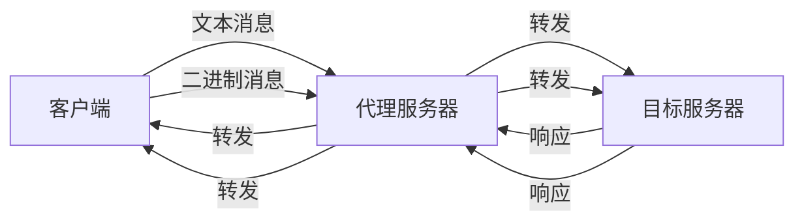

# VXCore WebSocket 反向代理指南

## 概述

VXCore框架现在支持WebSocket反向代理功能，可以将客户端的WebSocket连接代理到后端服务器，实现WebSocket连接的双向转发。

## 配置说明

### 1. 基本配置结构

```yaml
proxy:
  - listen: 8086
    # WebSocket代理配置
    sock:
      - path: /ws/real/
        origin: 127.0.0.1:8088
        enabled: true
      - path: ~^/ws/chat/.*
        origin: 127.0.0.1:8088
        enabled: true
```

### 2. 配置参数说明

| 参数 | 类型 | 说明 | 示例 |
|------|------|------|------|
| `path` | String | 匹配路径，支持正则表达式（以~开头） | `/ws/chat/` 或 `~^/ws/.*` |
| `origin` | String | 目标服务器地址 | `127.0.0.1:8088` 或 `localhost:8088/ws` |
| `enabled` | Boolean | 是否启用该代理规则 | `true` 或 `false` |

### 3. 路径匹配规则

#### 前缀匹配
```yaml
sock:
  - path: /ws/chat/
    origin: 127.0.0.1:8088
```
- 匹配所有以 `/ws/chat/` 开头的WebSocket连接
- 例如：`/ws/chat/room1` → `127.0.0.1:8088/ws/chat/room1`

#### 正则匹配
```yaml
sock:
  - path: ~^/ws/chat/.*
    origin: 127.0.0.1:8088
```
- 使用正则表达式匹配
- 以 `~` 开头表示正则匹配
- 例如：`/ws/chat/room1` → `127.0.0.1:8088/ws/chat/room1`

### 4. 目标地址解析

#### 基本格式
```
origin: host:port/path
```

#### 示例
```yaml
# 完整地址
origin: 127.0.0.1:8088/ws/chat

# 默认端口80
origin: localhost/ws/chat

# 默认路径 /
origin: 127.0.0.1:8088
```

## 完整配置示例

### 1. 多WebSocket服务代理

```yaml
proxy:
  - listen: 8080
    # 聊天服务WebSocket代理
    sock:
      - path: /ws/chat/
        origin: 127.0.0.1:8081
        enabled: true
      - path: /ws/notification/
        origin: 127.0.0.1:8082
        enabled: true
      - path: ~^/ws/game/.*
        origin: 127.0.0.1:8083
        enabled: true

  - listen: 8086
    # 测试环境WebSocket代理
    sock:
      - path: /ws/test/
        origin: 127.0.0.1:8088
        enabled: true
    # 静态文件服务
    static:
      path: /test/
      root: webroot/test/
```

### 2. 生产环境配置

```yaml
proxy:
  - listen: 443
    # SSL配置
    ssl:
      enable: true
      ssl_certificate: ssl/server.pem
      ssl_certificate_key: ssl/privkey.key
    
    # WebSocket代理
    sock:
      - path: /ws/
        origin: 127.0.0.1:8080
        enabled: true
    
    # HTTP API代理
    location:
      - path: /api/
        origin: 127.0.0.1:8080
```

## 工作原理

### 1. 连接建立流程

```
客户端 → 代理服务器 → 目标服务器
   ↓         ↓           ↓
WebSocket   WebSocket   WebSocket
连接请求    代理转发     连接建立
```

### 2. 消息转发机制



### 3. 支持的WebSocket特性

- ✅ 文本消息转发
- ✅ 二进制消息转发
- ✅ Ping/Pong心跳
- ✅ 连接关闭处理
- ✅ 异常处理
- ✅ 请求头转发

## 使用示例

### 1. JavaScript客户端

```javascript
// 连接到代理服务器
const socket = new WebSocket('ws://localhost:8080/ws/chat/room1');

socket.onopen = function(event) {
    console.log('WebSocket连接已建立');
    socket.send('Hello from client!');
};

socket.onmessage = function(event) {
    console.log('收到消息:', event.data);
};

socket.onclose = function(event) {
    console.log('WebSocket连接已关闭');
};

socket.onerror = function(error) {
    console.error('WebSocket错误:', error);
};
```

### 2. Java客户端（Vert.x）

```java
WebSocketClient client = WebSocketClient.create(vertx);
client.connect(8080, "localhost", "/ws/chat/room1")
    .onSuccess(webSocket -> {
        System.out.println("WebSocket连接已建立");
        
        webSocket.textMessageHandler(message -> {
            System.out.println("收到消息: " + message);
        });
        
        webSocket.writeTextMessage("Hello from Java client!");
    })
    .onFailure(error -> {
        System.err.println("连接失败: " + error.getMessage());
    });
```

### 3. 后端WebSocket服务

```java
@WebSocketHandler(value = "/ws/chat", description = "聊天WebSocket服务")
public class ChatWebSocketHandler {
    
    @OnOpen("用户连接")
    public void onOpen(ServerWebSocket socket) {
        System.out.println("新用户连接: " + socket.path());
        socket.writeTextMessage("欢迎加入聊天室!");
    }
    
    @OnMessage(type = OnMessage.MessageType.TEXT, value = "处理消息")
    public void onTextMessage(ServerWebSocket socket, String message) {
        System.out.println("收到消息: " + message);
        socket.writeTextMessage("Echo: " + message);
    }
    
    @OnClose("用户断开")
    public void onClose(ServerWebSocket socket) {
        System.out.println("用户断开连接: " + socket.path());
    }
}
```

## 故障排除

### 1. 常见问题

#### 连接被拒绝
```
WebSocket connection to 'ws://localhost:8080/ws/chat/' failed
```
**解决方案**：
- 检查代理服务器是否启动
- 检查目标服务器是否运行
- 检查防火墙设置

#### 路径不匹配
```
No matching WebSocket proxy config for path: /ws/chat/
```
**解决方案**：
- 检查配置文件中的path设置
- 确认路径匹配规则正确
- 检查enabled参数是否为true

#### 目标服务器连接失败
```
Failed to connect to target WebSocket: ws://127.0.0.1:8088/ws/chat
```
**解决方案**：
- 检查目标服务器地址和端口
- 确认目标服务器支持WebSocket
- 检查网络连通性

### 2. 调试技巧

#### 启用详细日志
```yaml
# 在配置文件中添加日志级别
logging:
  level: DEBUG
```

#### 检查配置加载
```java
// 在代码中打印配置
LOGGER.info("WebSocket proxy config: {}", config);
```

#### 监控连接状态
```javascript
// 客户端监控
socket.onopen = function(event) {
    console.log('连接建立时间:', new Date());
};

socket.onclose = function(event) {
    console.log('连接关闭时间:', new Date());
    console.log('关闭代码:', event.code);
    console.log('关闭原因:', event.reason);
};
```

## 性能优化

### 1. 连接池配置
```yaml
proxy:
  - listen: 8080
    # HTTP客户端配置
    http_client:
      max_pool_size: 100
      keep_alive: true
      idle_timeout: 30
```

### 2. 心跳设置
```yaml
proxy:
  - listen: 8080
    # WebSocket心跳配置
    websocket:
      ping_interval: 30
      pong_timeout: 10
```

### 3. 负载均衡
```yaml
proxy:
  - listen: 8080
    sock:
      - path: /ws/chat/
        # 多个目标服务器
        origin: 
          - 127.0.0.1:8081
          - 127.0.0.1:8082
          - 127.0.0.1:8083
        # 负载均衡策略
        load_balance: round_robin
```

## 安全考虑

### 1. 访问控制
```yaml
proxy:
  - listen: 8080
    sock:
      - path: /ws/chat/
        origin: 127.0.0.1:8081
        # 访问控制
        access_control:
          allowed_origins: 
            - "https://example.com"
            - "https://app.example.com"
          require_auth: true
```

### 2. SSL/TLS支持
```yaml
proxy:
  - listen: 443
    ssl:
      enable: true
      ssl_certificate: ssl/server.pem
      ssl_certificate_key: ssl/privkey.key
    sock:
      - path: /ws/
        origin: 127.0.0.1:8080
```

### 3. 请求头过滤
```yaml
proxy:
  - listen: 8080
    sock:
      - path: /ws/chat/
        origin: 127.0.0.1:8081
        # 过滤敏感请求头
        header_filter:
          remove:
            - "Authorization"
            - "Cookie"
```

## 监控和指标

### 1. 连接统计
- 当前连接数
- 总连接数
- 连接建立/关闭速率
- 平均连接时长

### 2. 消息统计
- 消息发送/接收数量
- 消息大小统计
- 消息类型分布

### 3. 错误统计
- 连接失败次数
- 消息转发失败次数
- 超时次数

## 总结

VXCore的WebSocket反向代理功能提供了完整的WebSocket连接代理解决方案，支持：

- 🔄 双向消息转发
- 🛡️ 连接管理和异常处理
- ⚙️ 灵活的配置选项
- 📊 完整的监控支持
- 🔒 安全访问控制

通过合理配置，可以实现高性能、高可用的WebSocket代理服务。
